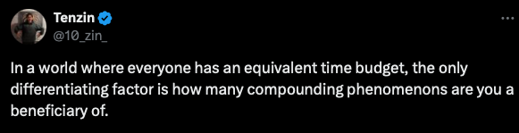

# core_truths
A slow, personalized collection of core truths of life I discover along the way.

## The world
1. Desire is suffering - Buddha
2. I don't know how to teach it (resilience) to you except that I hope suffering happens to you - Jensen Huang (After NVIDIA crossed 3T$ marketcap)
4. The only test of intelligence/success is if you can get what you want from life. - Naval
5. The limits of my language mean the limits of my world - Wittgenstein

## Collaboration with Me
1. creativity is born out of unproductivity. - Cari He + Tenzin

## Mine:
1. Belief is the most foundational basis for all our deductions. - Tenzin
2. 
